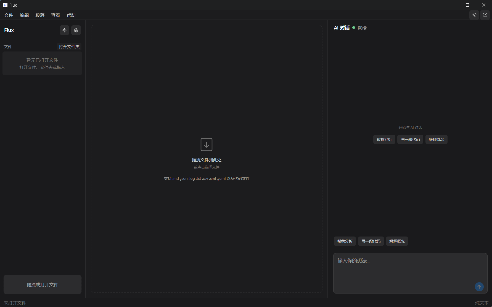
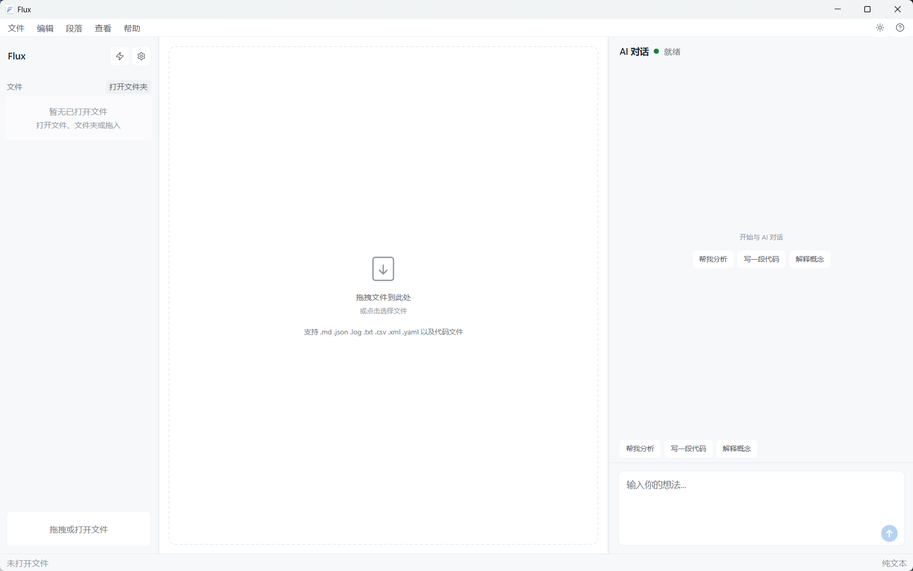

# Flux

AI 驱动的沉浸式文本工作站。编辑、分析、阅读文本，配合 AI 辅助——为**心流**而设计，一种深度专注、忘记时间、人与工具合一的状态。

> 命名源自拉丁语 **fluxus**——流动、变化、通量、持续变动的状态。如同河水奔流不息，思想与代码在时间中不断演进，永不停滞。

## 界面预览

### 软件图标


### 暗色主题



### 亮色主题


## 功能特性

### 文件管理
- **打开文件/文件夹** — 支持单文件编辑和文件夹工作区模式
- **文件树浏览** — 左侧面板浏览工作区文件结构，快速切换
- **新建文件** — 默认文件名为 `untitled.md`（与首项 Markdown 类型一致）
- **覆盖新建** — 目标文件已存在且确认替换时，会覆盖为新建空文件内容
- **关闭已打开文件** — 文件列表每项支持直接关闭（`×` 按钮）
- **拖拽导入** — 拖放文件到窗口即可打开
- **编码检测** — 自动识别文件编码（iconv-lite）

### 编辑器
- **多语言语法高亮** — 支持 JavaScript、TypeScript、Python、C/C++、CSS、HTML、JSON、Markdown、SQL、XML 等
- **Markdown 编辑** — 支持源码编辑、实时预览、WYSIWYG 富文本三种模式
- **大纲联动** — Markdown 文件自动生成标题大纲，点击跳转对应章节
- **日志查看器** — 专用日志高亮和行着色，快速定位关键信息
- **搜索面板** — 编辑器内查找/替换
- **段落菜单** — 快速插入标题（H1-H5）、有序/无序列表、引用块、代码块、表格、水平分割线
- **JSON 上下文菜单** — JSON 文件右键快捷操作
- **可扩展编辑器模式** — 注册机制支持自定义文件类型处理器

### AI 对话
- **多轮对话** — 右侧面板与 AI Agent 持续交互
- **@ 文件引用** — 输入 @ 选择文件，将文件内容作为上下文发送
- **/Skill 调用** — 输入 / 选择已安装技能，强制特定分析流程
- **选区引用** — 将编辑器当前选中文本作为上下文发送
- **工具调用可视化** — 实时展示 Agent 工具调用过程（搜索、读写文件等）
- **流式响应** — AI 回复逐字流式输出，带进度提示
- **会话状态提示** — 思考中、处理中等多种状态动效反馈
- **建议芯片** — 根据上下文智能推荐下一步操作

### Skill 技能系统
- **内置技能** — 系统预置常用分析技能
- **导入技能** — 支持导入单文件（.md）或目录（技能包，含模板、脚本等）
- **启用/禁用** — 灵活控制技能是否参与对话
- **失效检测** — 入口文件或资源目录缺失时自动标记并提示
- **技能预览** — 查看技能完整内容和使用说明

### 报告导出
- **Markdown 导出** — 将分析结果导出为结构化 Markdown 报告
- **系统保存对话框** — 选择保存路径和文件名
- **导出状态反馈** — 保存中 / 已保存状态提示

### 多 Provider 支持
- **预设提供商** — Anthropic、OpenAI、DeepSeek、Kimi、GLM、Qwen、自定义
- **模型目录** — 动态模型列表，自动标记已弃用/已下线模型
- **连接测试** — 保存前验证 API 连通性
- **API Key 管理** — 密钥显隐切换，本地安全存储
- **持久化配置** — electron-store 本地持久化，重启不丢失

### 主题
- **暗色/亮色模式** — 一键切换，跟随系统或手动选择
- **原生标题栏集成** — Windows/macOS 标题栏自适应主题

### 界面布局
- **三栏布局** — 左侧文件树 + 中间编辑器 + 右侧 AI 对话
- **可拖拽分隔条** — 面板宽度自由调节
- **菜单栏** — 文件、编辑、段落、查看、帮助五大菜单
- **状态栏** — 底部状态信息显示
- **虚拟滚动** — 大量消息列表高性能渲染（react-virtuoso）
- **快捷键支持** — Ctrl+X/C/V 剪切复制粘贴、Ctrl+F 查找、Ctrl+A 全选

## 技术栈

| 类别 | 技术 |
|------|------|
| **运行时** | Electron 41 |
| **UI 框架** | React 19, Tailwind CSS 4 |
| **编辑器** | CodeMirror 6 (`@uiw/react-codemirror`), MDXEditor |
| **AI SDK** | Anthropic SDK, OpenAI SDK |
| **状态管理** | Zustand |
| **构建工具** | electron-vite, TypeScript |
| **测试** | Vitest, Testing Library |
| **图标** | Lucide React |
| **Markdown 渲染** | markdown-it, highlight.js |

## 快速开始

```bash
npm install
npm run dev
```

## 项目结构

```
flux-app/
├── src/
│   ├── main/              # Electron 主进程
│   │   ├── agent/         # AI Agent 逻辑（provider 路由、沙箱、历史截断）
│   │   ├── ipc/           # IPC 通道处理器
│   │   ├── services/      # 后端服务（文件、导出、工作区、Catalog）
│   │   ├── skill/         # Skill 技能系统（管理、匹配）
│   │   └── store/         # 持久化存储（electron-store）
│   ├── preload/           # 预加载脚本（context bridge）
│   ├── renderer/          # React 前端
│   │   └── src/
│   │       ├── components/  # UI 组件
│   │       │   ├── chat/      # 对话面板、输入框、消息、工具卡片
│   │       │   ├── editor/    # 编辑器、预览、大纲、搜索、日志查看
│   │       │   ├── layout/    # 布局（标题栏、菜单栏、侧栏、状态栏）
│   │       │   ├── settings/  # 设置页面
│   │       │   ├── skill/     # 技能管理页面
│   │       │   ├── export/    # 报告导出
│   │       │   ├── help/      # 帮助中心
│   │       │   └── common/    # 通用组件（文件树、Toast、拖拽区）
│   │       ├── hooks/       # 自定义 Hooks
│   │       ├── stores/      # Zustand 状态（文件、编辑器、对话、设置、布局）
│   │       ├── config/      # Provider 预设配置
│   │       ├── registry/    # 编辑器模式注册
│   │       ├── editor/      # CodeMirror 扩展（语法高亮、日志着色）
│   │       └── utils/       # 工具函数
│   └── shared/             # 共享类型定义、IPC 通道常量
├── resources/              # 应用图标资源
├── tests/                  # 测试文件
├── out/                    # 构建输出
├── electron.vite.config.ts
├── package.json
└── tsconfig.json
```

## 脚本命令

| 命令 | 说明 |
|------|------|
| `npm run dev` | 启动开发服务器（HMR） |
| `npm run build` | 生产构建 |
| `npm run preview` | 预览生产构建 |
| `npm run pack` | 构建 + 打包桌面应用 |
| `npm run pack:win` | 构建 + 打包 Windows 安装包 |
| `npm run pack:mac` | 构建 + 打包 macOS 安装包 |
| `npm run test` | 运行单元测试 |
| `npm run test:watch` | 监听模式运行测试 |
| `npm run lint` | ESLint 代码检查 |
| `npm run format` | Prettier 代码格式化 |

## 使用指南

详细使用帮助请查看应用内 **帮助 > 使用说明**，或直接阅读 [help-content.md](./src/renderer/src/help/help-content.md)。
版本与发布记录请查看 [ReleaseNote.md](./ReleaseNote.md)。

### 推荐工作流

1. 打开目标日志或代码文件（或整个文件夹）
2. 用 1-2 句话描述你的分析目标和约束
3. 必要时用 `@文件` 追加上下文，用 `/技能名` 指定分析流程
4. 先获取结论，再让 Agent 生成可执行的修复步骤
5. 导出 Markdown 报告归档到项目文档

### 文件管理补充说明

1. 新建文件时，保存对话框默认名称为 `untitled.md`。
2. 如果选择一个已存在文件并确认替换，系统会清空该文件后再作为新建文件打开。
3. 在左侧“文件/工作集”列表中，可点击文件行末的 `×` 关闭该已打开文件。
