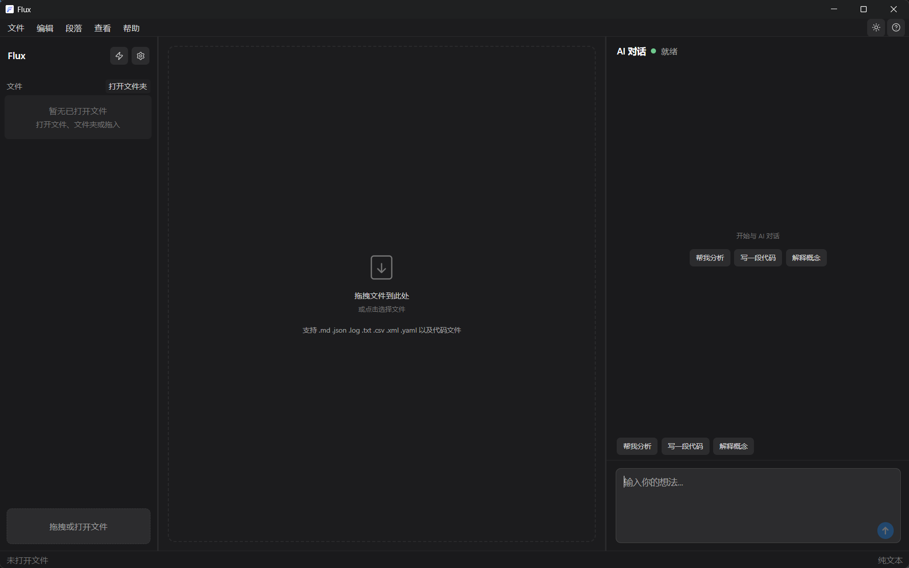

# 一级标题

[跳转到表格](#表格) · [跳转到脚注](#脚注)

这是普通段落。它包含 **粗体**、*斜体*、***粗斜体***、~~删除线~~、`行内代码` 和一个 [外部链接](https://example.com)。  
这里使用两个尾随空格强制换行。

## 二级标题

### 三级标题

#### 四级标题

##### 五级标题

###### 六级标题

## 列表

- 无序项目
  - 二级项目
    - 三级项目
- 另一个项目

1. 第一项
2. 第二项
   1. 嵌套编号
   2. 第二个嵌套编号

- [ ] 未完成任务
- [x] 已完成任务
- [X] 大写标记的已完成任务

## 引用

> 这是一段引用。
>
> > 这是嵌套引用。

## 表格

| 左对齐 | 居中 | 右对齐 | 长内容换行 |
| :--- | :---: | ---: | --- |
| Alpha | Beta | 123 | 这是一段用于验证表格单元格自动换行的较长文本 |
| 中文 | 混合内容 | 456.78 | `inline code` |

## 代码

```typescript
interface DocumentState {
  path: string
  dirty: boolean
}

const state: DocumentState = { path: 'README.md', dirty: false }
```

未知语言仍应安全显示：

```flux-example
plain <content> & symbols
```

## 图片



## 分隔线

上方内容。

---

下方内容。

## 脚注

Flux 支持标准脚注引用。[^flux]

同一脚注可以再次引用。[^flux]

[^flux]: 这是脚注正文，其中可以包含 **Markdown**。

## 原始 HTML

<details open>
<summary>可折叠内容</summary>

使用 <kbd>Ctrl</kbd> + <kbd>S</kbd> 保存文档。

</details>

<mark>原始 HTML 标记内容</mark>

## 转义与实体

\*这不是斜体\*，\# 这不是标题，HTML 实体：&copy; &amp; &lt;。

## 自动链接

https://example.com/docs

联系邮箱：<flux@example.com>

## 兼容性保留

行内公式在基础模式下保留原文：$E = mc^2$。


文档尾部标记：`MARKDOWN_PREVIEW_END`。
